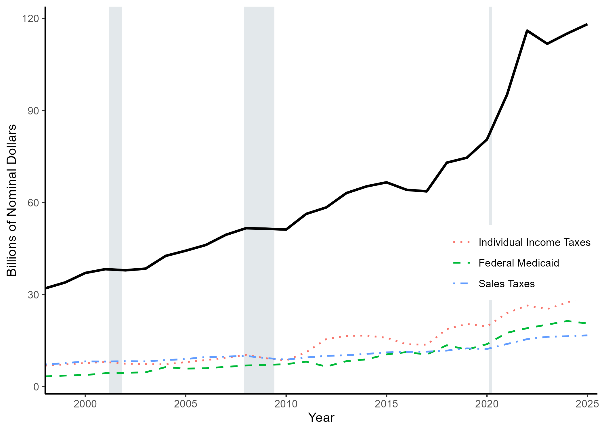
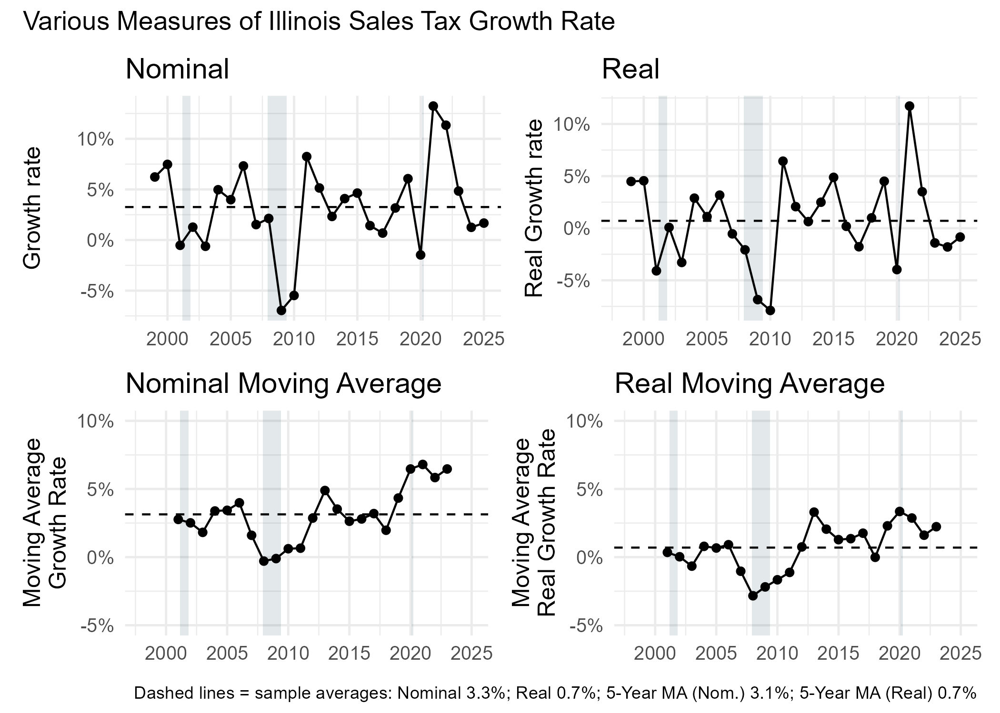
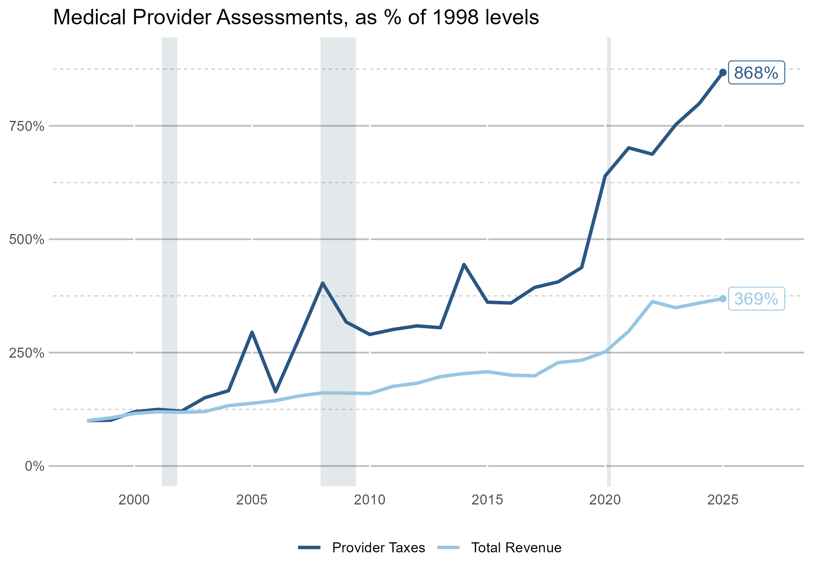
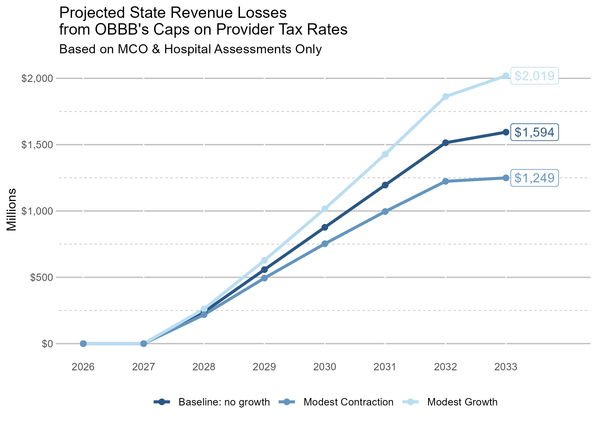

## Report Tables and Figures

### Figure 1

{width=100%}


### Table 1

```{r}
#| echo: false
#| results: asis


cat(readr::read_file("../Fiscal Futures FY2025/generated/TABLE1.html"))

```


### Figure 2 




### Figure 3

#### Logic & Background (from “logicmodel” sheet in obbb_v6.xlsx)

**Goal.** Back-of-the-envelope estimate of **OBBB’s impact on Illinois’ ability to levy and collect provider taxes**. Dollar amounts below are **millions, nominal**.

#### Tax revenues (FY2025, as provided)
- **MCO assessments:** $1,821.5. [Illinois Comptroller](https://illinoiscomptroller.gov/financial-reports-data/revenues-state-income/revenue-source?RevSel=2683&RevGrpSel=0&RevClsSel=0&RevTypeSel=0&FY=25&GroupBy=None&GetQueryData=Search)
- **Hospital assessments:** $2,004.6. [Illinois Comptroller](https://illinoiscomptroller.gov/financial-reports-data/revenues-state-income/revenue-source?RevSel=0133&RevGrpSel=0&RevClsSel=0&RevTypeSel=0&FY=25&GroupBy=None&GetQueryData=Search)
- **Total (MCO + Hospital):** $3,826.1  
- **Healthcare Provider Supplemental Assessment (County Hospital?):** $886.5 (see “For_Alea” tab in the workbook)
- **Alternative assumption (add county hospital assessment):** $4,712.6  
- **Assumed FY2025 revenue base used here:** $4,712.6. [FF summary workbook](https://github.com/AleaWM/Fiscal-Futures/blob/main/data/FY2025%20Files/summary_file_FY25_PensionChange_2025_07_016.xlsx)

#### Tax base & rate assumption
- We need a dollar **tax base** (akin to net patient revenues). We observe dollars per bed-day / per member, but not a single base series.  
- Use an **assumed tax rate of 5.0%** for hospital and MCO assessments. Why 5%? KFF reports typical ranges **3.5%–5.5%** for hospitals; MCO rates less clear.  
  - Source: Burns, Hinton, Williams, Rudowitz, “**5 Key Facts About Medicaid and Provider Taxes**,” KFF, Mar 26, 2025. <https://www.kff.org/medicaid/issue-brief/5-key-facts-about-medicaid-and-provider-taxes/>

#### Timing & growth

- First 0.5 pp reduction required **Oct 1, 2028** → hits **SFY 2029** for **9 of 12 months (75%)**.  
- **Annual growth in base:** 1.0% (conservative; enrollment/utilization likely softening).





### Figure 4



### Appendix Item 1

```{r}
#| echo: false
#| results: asis


cat(readr::read_file("../Fiscal Futures FY2025/generated/App1_AllRevenueSources.html"))

```





